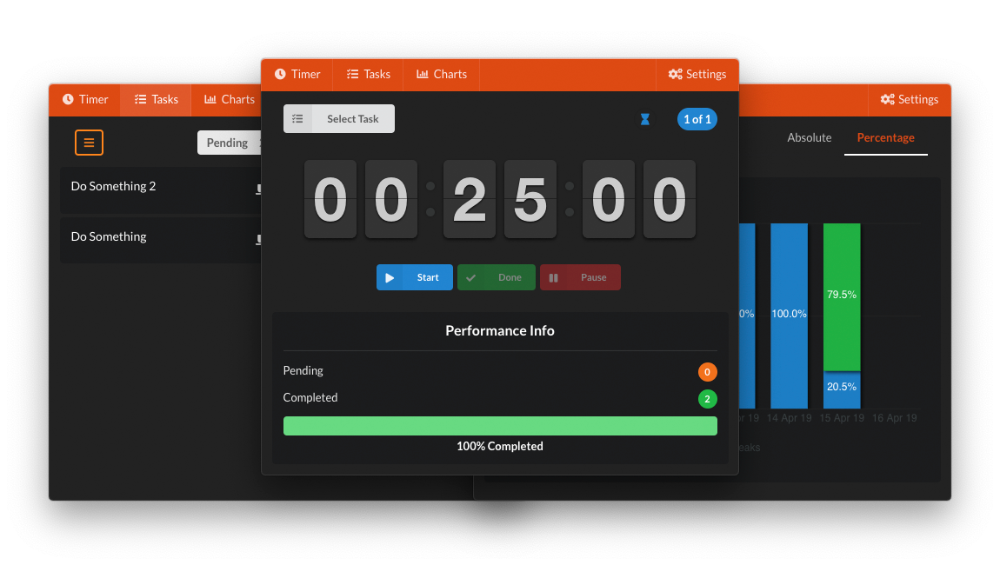

# DFocus

[](https://ci.appveyor.com/project/dlanileonardo/dfocus/branch/master)
[](https://travis-ci.org/dlanileonardo/dfocus)

<p align="center">
  
</p>

# Build Setup

```
# install dependencies
yarn install

# serve
yarn run dev

# build electron app for production
yarn run build

# lint all JS/Vue component files in `src/`
npm run lint

# lint all JS/Vue component files in `app/src`
yarn lint
```

# License

DFocus is licensed under the [MIT License](./LICENSE)


---

This project was generated with [electron-vue](https://github.com/SimulatedGREG/electron-vue) using [vue-cli](https://github.com/vuejs/vue-cli).
Documentation about the original structure can be found [here](https://simulatedgreg.gitbooks.io/electron-vue/content/index.html).
